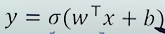
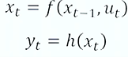
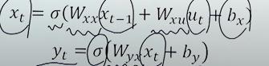

# 나의 첫 git TIL
## git 특강

git 특강을 듣고나서 처음으로 git을 이용해 TIL을 작성해 보게되었다.
실습을 진행하는 도중 에러 발생으로 인해 지체되어 프로필 이후로는 
제대로 실습하지 못했다.

## RNN
### Recurrent Neural Network
시계열 데이터를 처리하기에 좋은 뉴럴 네트워크 구조

for example: 
- 음성인식
- 음악 생성기
- DNA 염기서열 분석
- 번역기
- 감정 분석
---
- CNN : 이미지 구역별로 같은 WEIGHT 공유
- RNN : 시간 별로 같은 WEIGHT를 공유
- 즉 과거와 현재는 같은 WEIGHT를 공유

---

### First Order System

- 현재 시간의 상태가 이전 시간의 상태와 관련이 있다고 가정.
- 이 시스템은 외부 입력 없이 혼자서 돌아간다.(autonomous system)
- 현재 시간의 상태가 이전시간의 상태와, 현재의 입력에 관계가 있는 경우
  - 상태 : x , 입력 : u

### State_space Model
- 1차원 시스템의 모형:
  xt = f(xt-1,ut)

- Q : 모든 시간 t에서 모든 상태 xt가 관측 가능한가?
  - 날씨 예측 xt --> 일부만 관측 가능

- 각 시간에서 관측 가능한 상태의 모음 : 출력
  - yt = h(xt)

- 입력과 출력 사이에 보이지 않는(보일수도 있음) 
  hidden layer에서 (Neural Network) xt가 그 역할을 한다.

- 어떤 시스템을 해석하기 위한 3요소 :입력(y), 상태(x), 출력(y)

- RNN과 ANN의 가장 큰 차이점은 x가 셀프 피드백을 받는지 안받는지 

- RNN은 초기 조건이 필수적이다

- 상태 xt 가 의미하는 것은 Hidden layer의 state
- 상태 xt 는 이전까지의 상태와, 이전까지의 입력을 대표할 수 있는 압축본이라고 할 수 있다.
- 상태 xt 는 시계열로 들어오는 입력들을 최대한 상세히 표현할 수 있어야 한다.

- 원래 풀고 싶었던 문제 :
  - xt = f(ut,ut-1,ut-2,...,u0)
- 대신해서 풀 문제:
  - xt = f(xt-1,ut)
- First-order Markov Model:
  - 보통 바로 앞에 것만 RNN에서 사용한다

- State_Space Model에서 근사하는 함수는 2개
  - xt = f(xt-1,ut)
  - yt = h(xt)
- 뉴럴 네트워크에서 비선형 함수를 표현하는 방법:
  - 

- State_Space model 에서 근사하는 함수는 2개 

- 뉴럴 네트워크 셋팅으로 함수 근사:
  - 
  - 사용하는 parameter matrix는 총 5개 (w 3개, b 2개)

### RNN Training

- ANN, CNN처럼 back-propagation을 이용
- Back-propagation through time(BPTT)

### RNN Problem Types

- Many-to-many : 인풋 아웃풋 둘다 여러개
  - 번역
- Many-to-one : 인풋 여러개 아웃풋 하나
  - 시계열 예측
- One-to-many : 인풋 하나 아웃풋 여러개
  - 생성
- Sequence-to-sequence = many-to-one + one-to-many

### RNN 단점
- RNN의 한계점:
  - Exploding,vanishing gradient
- RNN 구조에서 state xt에는 Wxx가 계속 곱해지게 된다
  - 곱해지는 값이 1보다 크다면 --> 무한대
  - 곱해지는 값이 1보다 작다면 --> 0

### RNN Exploding gradient

- 학습 도중 loss 가 inf가 뜰 경우
  - 학습이 더이상 진행이 불가능하다
- 해결책 :
  - gradient clipping ( 가둬 놓는 것이나, 근본적인 문제 해결 불가능하다 )

### RNN vanishing gradient
- 학습 도중 파악이 어렵다.
- 초기화를 간결하게 해주는 방법 존재하지만 
  - 다른 네트워크 구조를 제안하는 것이 훨씬 편하다.
    - Gated RNNs: LSTM / GRU
## LSTM : Long short-term memory
- gradient flow를 제어할수 있는 역할
- State space의 입력,상태,출력 구조는 동일
  - Gate 구조의 추가
  - 4개의 MLP구조

### LSTM :Four Regulations
- Step 1 : 새로운 입력과 이전 상태를 참조해서
  - 이 정보를 얼마의 비율로 사용할 것인지를 결정
  - (또는) 얼마나 잊어버릴 것인가?
- Step 2 : 새로운 입력과 이전 상태를 참조해서
  - 이 정보들을 얼마나 활용할 것인가를 결정
  - (+) 어떤 정보를 활용할 것인가도 결정
- Step 3 :
- Step 1에서는 얼마나 잊어버릴까?
- Step 2에서는 얼마나 이용할까?
- 이 둘을 적절히 섞는다.
- step 4 : 일련의 정보들을 모두 종합해서 다음 상태를 결정

## GRU :Simplification of LSTM

- 방금까지 본 LSTM 모델 :너무 복잡함
  - GRU는 LSTM의 간소화 버전
  - Cell state가 없음 (input, forget, output만 존재)
    - cell state는 일종의 hidden state임

- LSTM보다 파라미터 수가 적으므로 training time이 절약된다.
- LSTM보다 성능이 좋은가? -> Task에 따라 천차만별.
  - But LSTM과 GRU가 RNN보다는 확실히 성능을 보장한다.

### RNN Problem Solving
- *회귀
- ANN은 하나의 인풋에 하나의 아웃풋만 가능
- 올라가는 커브,내려가는 커브인지에 따라 아웃풋이 다르다면, RNN사용
- RNN은 일종의 인코더라고 볼수 있다.
- ANN은 디코더라고 볼수 있다.

### Machine Translation
- 영어에서 프랑스어로 번역
  - RNN 쌓기 -> 들어가는 것은 영어고, 나오는 것은 프랑스어 
  - 전체 문장을 보고 특징으로 번역된 문장을 생성
### Recap : N-gram language model
- I am a graduate student (정보불충분, 이전,이후 정보 확인 불가)

### Seq2Seq Model : Structure
- LSTM에서 Encoder RNN구조 Decoder RNN구조 가져오기
- 인코더에서는 인풋 시계어 넣으면 특징을 가진 데이터가 디코더로 이동하여
  디코더에서 출력
- 학습 : incoder에서 State만 decoder로 decoder에서 학습 (superviser model)
- 시작과 끝을 붙여 하나씩 밀림 : test할때는 말이 되나,
  - 학습할 땐 좋지 않은 영향을 미침 따라서 Teacher -Force Training 사용
### Seq2Seq model :Teacher-Force Training
- 학습이 제대로 이루어지지 않았을때 잘못된 결과를 내놓는다면 연쇄적으로 배열이
  틀릴 수 있다. 그래서 ttention 이라는 방법이 생김.
- 전체 뭉터기로 들어온 것을 하나로 특징을 모두 참조할 수 있다는 장점.

### Seq2Seq Model :Full Process
1. Word Tokenization & Encoding
2. Traning 
3. Validation & Testing

### Summary
- 인코더에 뭉텅이로 입력하면 디코더로 이동하여 뭉텅이로 나옴
그 뭉텅이가 다시 디코더로 들어감.

## 이미지 처리할때 CNN을 자연어처리에 이용
- 사진에 필터를 거친다 이미지의 피쳐를 레이어를 거쳐 분류문제를 푼다.
- 1D CNN으로 자연어 처리에 사용
 
### Word2Vec
- 2줄짜리 필터를 한칸씩 이동하며 피쳐를 학습 필터들의 weight 학습

### Max Pooling

### 1D-CNN Network Structure
- 자연어 처리용 CNN이며
- Word2Vec 결과에 + conv filter

### BI-LSTM
- 방향이 앞뒤로 두개 (문장의 경우 앞뒤 단어를 참조하여야 하므로)
- inference : I love __ for always
- casualty 를 무시해도 될때 사용(예외 있음)
- 미래 데이터에서도 끌어옴.

## Attention 
- seq2seq에서 생기는 문제점을 보안하기 위해 사용
### Machine Translation
- 영어 문장이 단어 별로 쪼개져서 인코더로 들어가고, 
  인코더 셀을 통해서 컨텍스트 벡터가 만들어짐,
  시작하면 결과물이 디코더로 들어가서,...
- 병목현상 생길수 있고 정보가 불완전함.
- context vector 에 모든 정보가 함축
- vanishing, Exploding gradient
- context vector를 모두 사용한다(비효율적)

### Attention Score
- 디코더의 히든스테이트를 인코더의 히든스테이트와 내적
- 두 벡터의 내적 ->유사도가 높을수록 내적 값이 크다.
- hidden state의 유사도 
- 내적값이 attention Score
- attention score에 softmax함수를 붙여줌.합이 1 -> 가중치로 쓸수 있음.
- hidden state와 다시한번 곱해줌.

- attention Mechanism 은 현재 시점 예측에서 입력의 특정 부분에 보다 집중
할수 있도록 설계되었다.

### Attention in seq2seq
- 어순대로 간다, 숫자와 숫자 사이에는 attention이 강하다 등등
- Dot product
- Scaled Dot product
- Weighted Dot product

### Bahdanau Attention
- attention score를 구할때에도 Neural Network구조를 통과

### Transformer 구조
- attention machanism 만으로 

