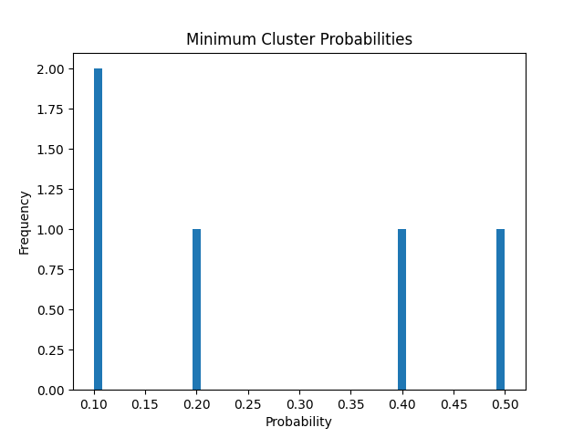

## GMM
```python
from sklearn.mixture import GaussianMixture # 거리로 그룹 나눔
import pandas as pd
import numpy as np
from sklearn.preprocessing import StandardScaler# 정규화 하기 위해

scaler = StandardScaler()
df= pd.read_csv('housingdata.csv')
df=df.dropna()
df_nomalized = scaler.fit_transform(df) # 정규화 scaler로 fit_transform하면 정규화 된다
gmm = GaussianMixture(n_components=2,random_state=42) 
# n_components는 몇개의 가우시안 분포로 모델링 할 것인지, random_state는 결과 재현성을 위해 난수 초깃값 고정
gmm.fit(df_nomalized) # GMM에 기존 데이터프레임을 적용
# fit이란? .fit은 머신러닝 모델을 데이터에 맞게 학습시키는 데 사용되는 메서드입니다. 데이터를 입력으로 받아 모델의 파라미터(예: 선형 회귀의 기울기와 절편, 클러스터링의 중심점 등)를 최적화합니다. fit은 지도 학습, 비지도 학습, 데이터 전처리 등 여러 작업에서 공통적으로 사용됩니다.
#.fit의 일반적인 역할
#모델 학습:
#
#.fit은 데이터를 사용해 모델을 학습시킵니다. 학습 결과로 모델의 내부 파라미터가 최적화됩니다.
#예: 선형 회귀에서 기울기와 절편 계산, 클러스터링에서 중심점(cluster center) 결정.
#데이터 변환기 준비:
#
#데이터 전처리기(예: StandardScaler)에서도 .fit을 사용해 데이터의 통계적 정보를 계산(평균, 표준편차 등)하고 준비합니다.
probabilities = gmm.predict_proba(df_nomalized)
# GMM에서 예상확률
outlier_mask = np.min(probabilities, axis=1) < 0.05
#  (axis=1) 행에서 가장 작은 GMM예상확률이 0.05 미만인 경우 이상치로 보겠다는 의미이다.
df['is_outlier'] = outlier_mask
outliers = df[outlier_mask]
# outlier_mask 의 값이 포함된 행들을 outliers로 하겠다는 뜻이군
df_cleaned = df[~outlier_mask]
print("\nCleaned DataFrame:")
print(df_cleaned)
print("Number of Outliers Detected:", outliers.shape[0])
import matplotlib.pyplot as plt

plt.hist(np.min(probabilities, axis=1), bins=50)
plt.title("Minimum Cluster Probabilities")
plt.xlabel("Probability")
plt.ylabel("Frequency")
plt.show()
```

```python
from sklearn.cluster import KMeans

# 데이터 준비
X = [[1, 2], [1, 4], [1, 0], [10, 2], [10, 4], [10, 0]]

# 모델 생성 및 학습
kmeans = KMeans(n_clusters=2, random_state=42)
kmeans.fit(X)  # 모델 학습

# 클러스터 중심 출력
print("클러스터 중심:", kmeans.cluster_centers_)
```

```python
import numpy as np
import matplotlib.pyplot as plt

# 예제 데이터
probabilities = np.array([
    [0.9, 0.1],
    [0.8, 0.2],
    [0.5, 0.5],
    [0.1, 0.9],
    [0.4, 0.6]
])

# 최소 확률 분포 계산
min_probabilities = np.min(probabilities, axis=1)

# 히스토그램 시각화
plt.hist(min_probabilities, bins=50) #bin은 막대 갯수
plt.title("Minimum Cluster Probabilities")
plt.xlabel("Probability")
plt.ylabel("Frequency") 
plt.show()
```



