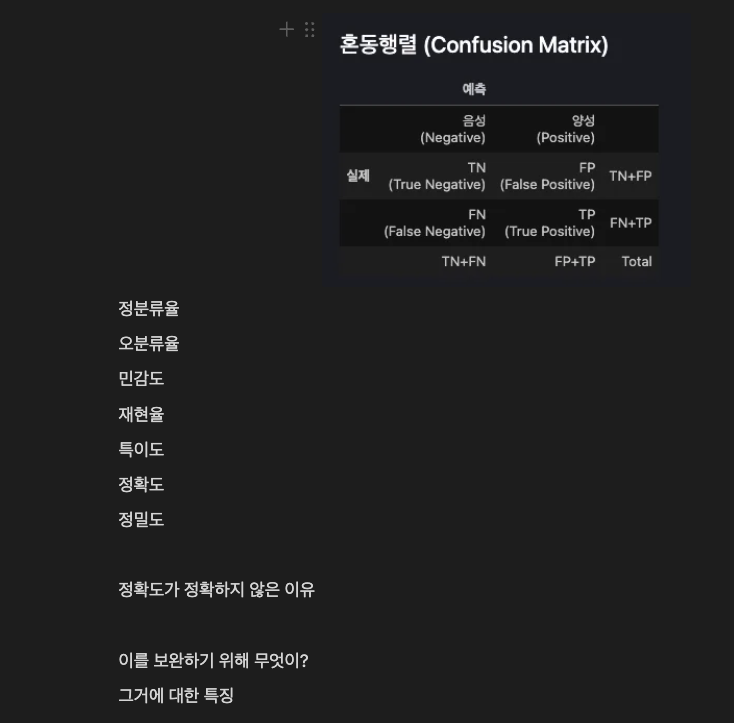

### 정분류율 
TP+TN/TOTAL
전체 예측중에서 정답을 맞춘 비율
### 오분류율
FP+FN/TOTAL
전체 예측중에서 틀린 비율
### 민감도
TP/(TP+FN)
실제 악당 중에서 악당이라고 예측한 비율
### 재현율
TP/(TP+FN)
실제 악당 중에서 악당이라고 예측한 비율
### 특이도
TN/(TN+FP)
즉 악당이 아닌 사람 중에서 악당이 아니라고 예상해서 맞춘사람의 비율
### 정확도
TP+TN/TOTAL
모델이 입력된 데이터에 대해 얼마나 정확하게 예측하는지를 나타낸다
### 정밀도
TP/(TP+FP)
악당이라고 예측한 사람 중 실제 악당의 비율
### 정확도가 정확하지 않은 이유
데이터가 치중되어있을 경우 모델의 예측에 따라 결정되는 것이 아니라 터무니 없는 모델에도 높은 수치가 나올 수 있다.
타이타닉 사망자가 남자 95% 여자 5%라면 
사망자를 예측할때 남자일 경우 사망 여자일 경우 생존이라는 조건만으로도 95%의 정확도를 만들 수 있다. 

### 이를 보완하기 위해 무엇이?
F1점수 = 2*재현율*정밀도/(재현율+정밀도)
### 그거에 대한 특징 
정확도의 단점을 보완하는 민감도와 정밀도 또한 각각의 단점이 있는데 이들의 조화평균으로 각각의 단점을 보완한다.
