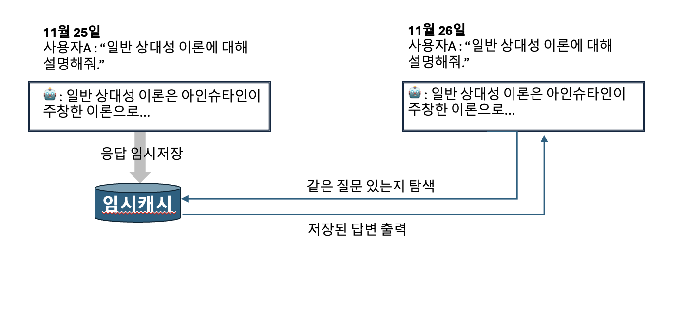
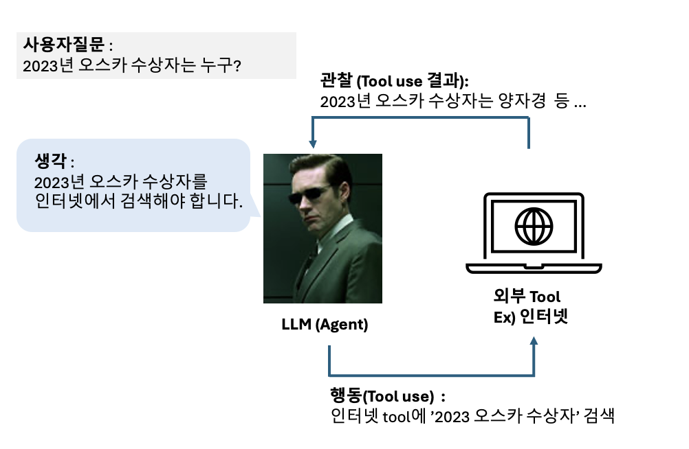

1. streaming
chat gpt는 사용자 질문에 마치 사람이 실시간으로 타이핑 하듯 답변하죠?

실제로 LLM은 한단어씩 답변을 생성하기 때문에, 실시간으로 한단어씩 보여주는 것이 가능합니다.

이런 streaming은 사용자가 답변대기시간을 지루하지 않게 만들어서 사용자 경험을 향상시키기 때문에 은근 중요합니다!

```python
from langchain_openai import ChatOpenAI

chat = ChatOpenAI(model_name="gpt-4o-mini")

#chat.invoke("고양이에 대한 시를 써줘.") # 평소에 완성된 대답을 받던 함수 (invoke)

for chunk in chat.stream("고양이에 대한 시를 써줘.") :
  print(chunk.content, end="", flush=True)
  ```

2. caching
실제 LLM 챗봇을 운영할때, 가장 중요한 것은 답변 속도입니다.

그런데 답변 속도는 모델의 크기나, 하드웨어의 성능 등 다소 고정된 환경에 의해 좌우됩니다.

따라서 주어진 환경에서 LLM의 답변 속도를 빠르게 만들기란 쉽지 않습니다.

하지만!! 실행하기 쉬우면서도 효과가 명확한 방법이 있는데 이는 응답을 캐싱해두기 입니다.



```python
%%time
from langchain.globals import set_llm_cache
from langchain.cache import InMemoryCache

chat = ChatOpenAI(model_name="gpt-4o-mini")
set_llm_cache(InMemoryCache()) # 캐시 메모리 설정
chat.invoke("일반 상대성 이론을 한마디로 설명해줘.") #첫번째로 물어봄 -> 응답시간이 길게 걸림
```

```python
%%time
chat.invoke("일반 상대성 이론을 한마디로 설명해줘.") #동일한 질문을 두번째로 물어봄 -> 응답시간이 훨씬 짧아짐
```


4. multi-turn 대화
ChatGPT를 사용하면 이전 대화를 계속 기억해 나가면서 대화를 이어나가는 것을 알 수 있습니다. 이렇게 전체 대화의 맥락을 읽고 대화를 주고 받는 것을 멀티턴 (Multi-turn) 이라고 합니다.

이와 다르게 바로 직전의 질문에만 답하는 것은 싱글턴 (single-turn) 이라고 합니다.

```python
from langchain.schema import SystemMessage
from langchain_community.chat_message_histories import ChatMessageHistory

model = ChatOpenAI(model_name="gpt-4o-mini")

# ChatMessageHistory 객체 생성
chat_history = ChatMessageHistory()

# System 메시지 추가 (history에 system 메세지 쌓기)
chat_history.messages.append(SystemMessage(content="너의 이름은 햄식이이고, 아주 귀여운 햄스터야. 모든 말을 햄으로 끝내."))

# 사용자 메시지 추가 (history에 user message 쌓기)
chat_history.add_user_message("햄식아 나 어제 수능쳤어 대박이지")

# AI 메시지 추가 (history에 ai message 쌓기)
chat_history.add_ai_message("진짜햄? 고생 많았햄!!")

### 최종적으로 chat history 객체에는 메세지들이 쌓여있다.

# 저장된 대화 히스토리 확인
for msg in chat_history.messages:
    print(f"{msg.type}: {msg.content}")

## 히스토리를 넣어주고, 대화하기
messages = chat_history.messages
print(model(messages))
```

에이전트하면 요원을 떠올릴 수 있습니다.

LLM에서는 **AI 에이전트란 주어진 명령에 대해 직접 액션 플랜을 세우고, 이를 차례대로 실행하여 완성도 높은 작업 수행이 가능한 AI 프레임워크**를 뜻합니다.

정말 요원 같죠?

우리는 이 중 Tool이라는 도구를 활용해서 복잡한 작업을 해결하는 Agent를 만들어보겠습니다.




6. 다른 사람들의 프롬프트를 써보자! : langsmith hub 맛보기

```python
from langchain import hub

# pull a chat prompt
prompt = hub.pull("efriis/my-first-prompt") # my-first-prompt라는 프롬프트를 땡겨왔다.

# create a model to use it with
from langchain_openai import ChatOpenAI
model = ChatOpenAI()

# use it in a runnable
runnable = prompt | model
response = runnable.invoke({
	"profession": "elementary student",
	"question": "What is special about parrots?",
})

print(response)
```


💡 실습 : 내 RAG 이 이렇게 성능이 좋아진다고...? 🥸
아래의 RAG 코드에서, RAG 프롬프트를 prompt hub에서 찾은 프롬프트로 대체해보세요.

찾은 프롬프트의 포맷에 맞춰넣는 것에 주의하세요!

```python
from langchain_community.vectorstores import FAISS
from langchain_community.document_loaders import WebBaseLoader
from langchain_core.output_parsers import StrOutputParser
from langchain_core.runnables import RunnablePassthrough
from langchain_openai import OpenAIEmbeddings
from langchain_text_splitters import RecursiveCharacterTextSplitter
from langchain_openai import ChatOpenAI
from langchain_core.prompts import ChatPromptTemplate
from langchain.document_loaders import PyPDFLoader


####################
####### RAG 챗봇 구축
###################

# 1. LLM 모델 불러오기
llm = ChatOpenAI(model="gpt-4o-mini")

# 2. 문서 불러오기
loader = PyPDFLoader("/content/[2024 한권으로 OK 주식과 세금].pdf")
docs = loader.load()

# 3. 문서 chunking 하기
text_splitter = RecursiveCharacterTextSplitter(chunk_size=1000, chunk_overlap=200)
splits = text_splitter.split_documents(docs)

# 4. 자른 chunk들을 embedding 하기
embeddings = OpenAIEmbeddings(model="text-embedding-ada-002")

# 5. vector store 구축하기
vectorstore = FAISS.from_documents(documents=splits, embedding=embeddings)

# 6. retriever 구축하기
retriever = vectorstore.as_retriever()

# 7. 프롬프트 템플릿 구축하기
prompt = hub.pull("krunal/more-crafted-rag-prompt")

# 8. 1~7. 요소들을 chain으로 조합하여 RAG 구축 완료
def format_docs(docs):
    return "\n\n".join(doc.page_content for doc in docs)

rag_chain = (
    {"context": retriever | format_docs, "question": RunnablePassthrough()}
    | prompt
    | llm
    | StrOutputParser()
)


####################
####### 구축한 RAG 챗봇 실행
###################

rag_chain.invoke("상장주식 대주주 기준이 50억 원 이상으로 완화되었는데 언제부터 적용되는 건가요?")
```